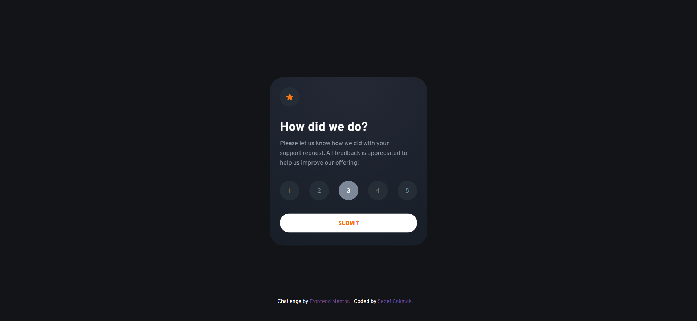

# Frontend Mentor - Interactive rating component solution

This is a solution to the [Interactive rating component challenge on Frontend Mentor](https://www.frontendmentor.io/challenges/interactive-rating-component-koxpeBUmI). Frontend Mentor challenges help you improve your coding skills by building realistic projects.

## Table of contents

- [Overview](#overview)
  - [Screenshot](#screenshot)
  - [Links](#links)
- [My process](#my-process)
  - [Built with](#built-with)
- [Author](#author)

## Overview

Basic Rating Component built with React using React Hooks, Styled Components with Global Styles.

### Screenshot

### Links

- Solution URL: [Add solution URL here](https://your-solution-url.com)
- Live Site URL: [Add live site URL here](https://your-live-site-url.com)

## My process

### Built with

- Mobile-first workflow
- [React](https://reactjs.org/) - JS library
- React Hooks (useState, useNavigate, useContext)
- [Styled Components](https://styled-components.com/) - For styles CSS in JS
- Global Styles

## Author

- Frontend Mentor - [@sedcakmak](https://www.frontendmentor.io/profile/sedcakmak)
- GitHub - [@sedcakmak](https://github.com/sedcakmak)
